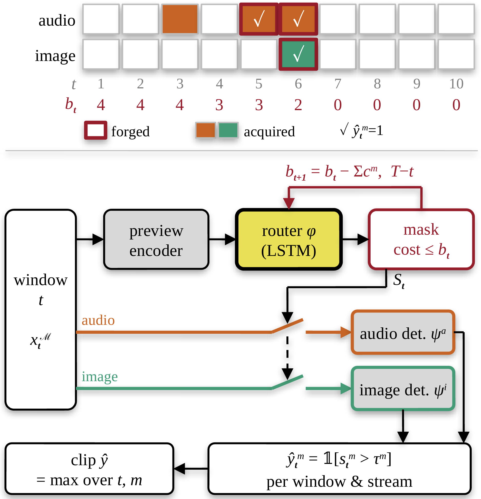
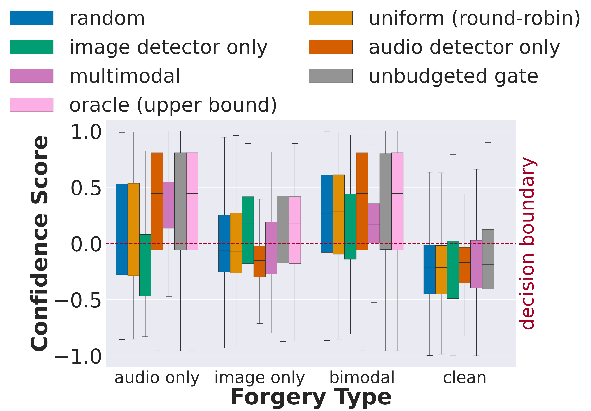
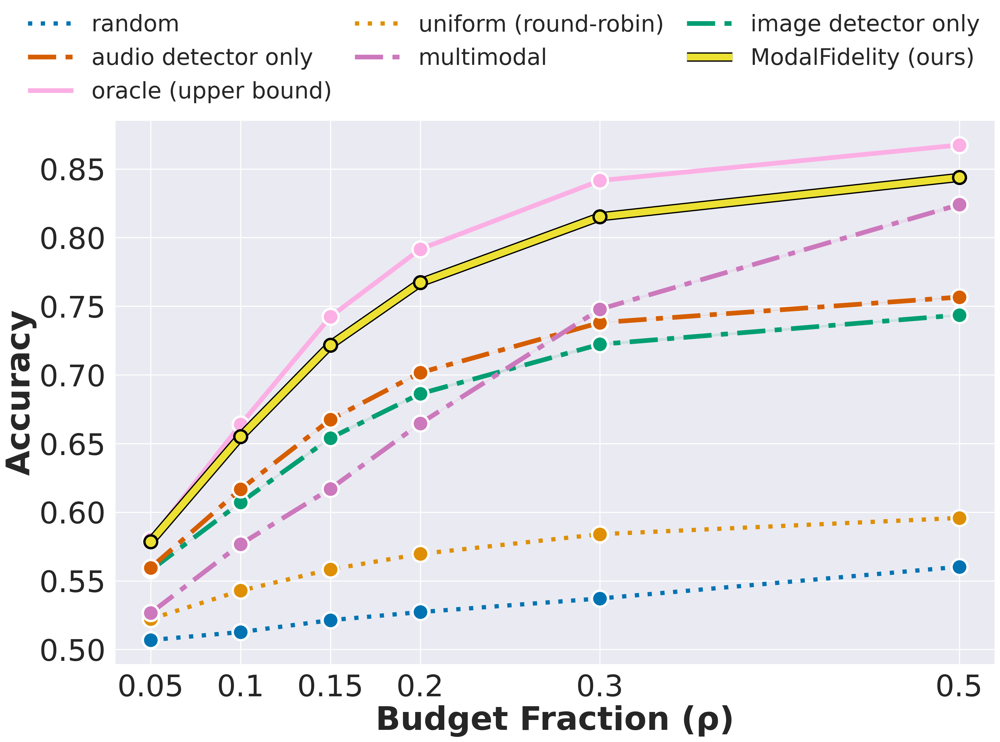

# ModalFidelity: Routing Modalities for Deepfake Detection on a Budget

<p align="center">
  
</p>

https://github.com/user-attachments/assets/d4e8d3fd-6714-471a-87a2-9c52ffe877b6


Deepfakes no longer need to fake a whole video. Generators that read the transcript now alter only the few seconds on which a video's meaning turns, so a forgery hides in a small, unknown fraction of the video. Yet detectors still read every one-second window of both the audio and image streams, spending nearly all of their compute where nothing was altered.

**ModalFidelity** is a lightweight router that previews each window and decides, before any forensic detector runs, which stream is worth reading, under a hard compute budget it can never exceed. On AV-Deepfake1M, reading at most a fifth of the windows, it is more accurate than gating after the detectors at **15.9× less compute**, and it retains **over 96%** of the accuracy of an oracle that knows where every forgery lies.

This repository holds the code, saved results and checkpoints behind the paper (ICASSP 2027):
- **Reproduce every figure and table** from the saved results with one notebook.
- **Evaluate** the released routers.
- **Re-create** the router's inputs from AV-Deepfake1M and **retrain** it.

---

## Contents

1. [Setup](#setup)
2. [Reproduce the paper](#reproduce-the-paper)
3. [Key results](#key-results)
4. [Evaluate and train](#evaluate-and-train)
5. [Repository structure](#repository-structure)
6. [Data and checkpoints](#data-and-checkpoints)
7. [Citation](#citation)

## Setup

**1. Environment.** A single conda environment covers everything. It pins the exact plotting versions that rendered the paper's figures, and ffmpeg 4.4, which the preview cache was built with.

```bash
git clone https://github.com/UTAustin-SwarmLab/modal-fidelity.git
cd modal-fidelity
conda env create -f environment.yml
conda activate modal-fidelity
pip install -e .            # installs the modalfidelity package and the mf-* commands
pytest -q                   # optional: the full test suite, about a minute on a CPU
```

- **Reproducing the figures needs nothing else**: no GPU and no downloads.
- **Evaluating or training the router** needs the checkpoints and the preview-feature cache (step 2).
- **GPU wheels:** PyTorch is installed as CUDA 12.6 wheels. On an older driver, change the `--extra-index-url` in `environment.yml` to the [matching PyTorch index](https://pytorch.org/get-started/locally/).

**2. Checkpoints and features (optional, 6.1 GB).**

```bash
python checkpoints/download.py                   # everything, verified against checkpoints/SHA256SUMS
python checkpoints/download.py --skip-features   # checkpoints only (≈ 650 MB)
python checkpoints/download.py --verify-only     # re-check files already in place
```

Files go to `checkpoints/` unless `MODALFIDELITY_DATA` points elsewhere.

**3. AV-Deepfake1M (optional).** Needed only to rebuild the preview cache from raw video. Request it from the [dataset authors](https://github.com/ControlNet/AV-Deepfake1M), then point `MODALFIDELITY_DATASET` at its root. You can also put `MODALFIDELITY_DATA=...` and `MODALFIDELITY_DATASET=...` lines in a `machine.env` file at the repository root, which git ignores.

## Reproduce the paper

```bash
jupyter nbconvert --to notebook --execute notebooks/reproduce_paper.ipynb --output-dir outputs/
# or, without Jupyter:
mf-reproduce-figures
```

Both regenerate Fig. 2, Fig. 3 and Table 1 from `data/` and check every number the paper states about them (28 of 28).

- **Pixel-identical:** with the pinned environment, the regenerated PNGs match the paper's figures pixel for pixel. `tests/test_paper_results.py` asserts this.
- **Deterministic:** nothing is sampled, so every run gives the same output.

Fig. 4 of the paper is not part of this release.

## Key results

### The router

<p align="center">
  
</p>

**How can our router cut cost without cutting accuracy?**
- **Bottom:** a cheap preview of each window *t* feeds the router φ (yellow, the only trained part), which picks the streams *S*<sub>t</sub> to acquire. A mask removes any action costing more than the remaining budget *b*<sub>t</sub> (red). Only acquired streams reach the frozen detectors ψ<sup>a</sup>, ψ<sup>i</sup> (grey), whose per-window, per-stream predictions ŷ<sub>t</sub><sup>m</sup> are max-pooled into the clip prediction ŷ.
- **Top:** one video with budget *B* = 4. The router saves its budget for the forged windows (red outline) and flags all three forged streams.

### Choosing the stream matters even without a budget

<p align="center">
  
</p>

**With no budget cap, does picking the stream still matter?** Yes.
- The plot shows per-window confidence by forgery type. Confidence is rescaled to [−1, 1], so 0 marks the decision boundary.
- Every window is affordable, but at most one stream per window is read.
- The unbudgeted gate reads the stream that carries the edit. On audio edits, its median matches the audio detector at +0.44, while the image detector sits at −0.25. On image edits, it matches the image detector at +0.18, while the audio detector sits at −0.15.
- It reaches 0.819 accuracy, against 0.666, 0.635 and 0.718 for the audio, image and multimodal detectors alone, and 0.839 for the oracle.

### Accuracy against the budget

<p align="center">
  
</p>

**Does spending more help without knowing where to look?** Accuracy against the budget fraction ρ.
- ModalFidelity stays within 2.6 pp of the oracle at every budget, and within 0.9 pp for ρ ≤ 0.10.
- At ρ = 0.10 it reaches 0.655, against at most 0.617 for any fixed detector and 0.543 for the blind allocators. The blind allocators stay near chance (0.51–0.60) however much they spend.
- Single-detector lines read one fixed stream on the router's windows.

### Where the gate belongs

**Table 1. Why route before the detectors rather than after?**

| Placement | | Calls/win. (↓) | GFLOPs/win. (↓) | Acc. (↑) |
|---|---|---:|---:|---:|
| Late MoE | dense | 2.000 | 4086.6 | .7264 |
| | feature | 2.000 | 4086.6 | .7298 |
| | output | 2.000 | 4086.6 | .7322 |
| Input (ours) | ρ=0.20 | 0.130 | 257.5 | .7672 |
| | ρ=0.30 | 0.161 | 327.3 | .8151 |
| | ρ=0.50 | 0.183 | 384.5 | **.8444** |

- **Late MoE gates** run both detectors on every window, which costs 4,087 GFLOPs per window wherever the gate sits.
- **At ρ = 0.20:** the router needs 15.9× fewer GFLOPs and 15.4× fewer detector calls, and it is more accurate.
- **At ρ = 0.50:** it is 10.6× cheaper and 11 pp more accurate.

**Headline numbers** (all recomputed by the notebook):

| | |
|---|---|
| Accuracy retained relative to the clairvoyant oracle | **> 96%** at every budget |
| Largest gap to the oracle | **2.6 pp** |
| Compute saved relative to the best late gate (ρ = 0.20) | **15.9×** fewer GFLOPs, **15.4×** fewer detector calls |
| Gain over single-detector baselines on the same windows (ρ = 0.20) | **6.6–8.1 pp** |
| Gain from stage 2 (policy gradient) over stage 1 (DAgger) alone | **1.9–6.5 pp** across budgets |

Accuracy is the mean of recall and specificity over windows, so a detector that calls everything authentic scores 0.5.

## Evaluate and train

The pipeline has five steps. Every command refuses to overwrite its outputs unless you pass `--overwrite`.

```
AV-Deepfake1M videos
  └─ mf-cache-previews   → preview cache (every other frame + audio spectrogram per video)
      └─ mf-cache-features   → preview features (frozen MobileNetV2 preview encoder)
          ├─ mf-train-router     → router checkpoints (stage 1 DAgger, then stage 2 policy gradient)
          └─ mf-evaluate-router  → detector-scored accuracy per budget (Fig. 3, data/budget_curves)
mf-train-late-moe / mf-evaluate-gate-placement / mf-measure-flops → Table 1
mf-reproduce-figures → Figs. 2–3, Table 1 and all paper numbers, from data/
```

- **To evaluate the released routers**, download the features and checkpoints; no raw video is needed.
- **Re-caching from raw video** reproduces the released preview cache byte for byte. Re-computed features can differ from the released ones in the last fp16 digit, because of GPU non-determinism. The paper's numbers use the released features.

### Command reference

Every command also answers `--help`.

**`mf-reproduce-figures`**: Figs. 2–3, Table 1 and the paper's numbers, from `data/`.

| Flag | Meaning |
|---|---|
| `--data` | directory of saved results (default: `data/`) |
| `--out` | where the figures go (default: `outputs/figures`) |
| `--overwrite` | replace figures already in `--out` |

**`mf-cache-previews`**: step 1. Decodes AV-Deepfake1M into the preview cache: every other frame at 160×160, and one log-STFT of the audio per video. It also repairs a leak in the released metadata: a single-stream forgery lists its forged segment under the *other* stream too, and the repair removes that copy.

| Flag | Meaning |
|---|---|
| `--dataset` | AV-Deepfake1M root (default: `$MODALFIDELITY_DATASET`) |
| `--split` | dataset split (default: `train`) |
| `--quadruples` | number of source clips, each cached in all 4 variants (default: 10000, as in the paper) |
| `--seed` | seed of the clip sample (default: 0) |
| `--shard`, `--num-shards` | build one shard of the sample (the paper used 32) |
| `--only-sources` | cache only these source clips |
| `--out` | output directory (required) |
| `--wav-dir` | where demuxed wav files go (default: `<out>/_wav`) |
| `--quality` | JPEG quality (default: 90) |

**`mf-cache-features`**: step 2. Runs the frozen preview encoder over every window.

| Flag | Meaning |
|---|---|
| `--preview-cache` | the preview cache from step 1 (required) |
| `--preview-weights` | preview-encoder weights, e.g. `checkpoints/preview/unbudgeted_gate.pt` (required) |
| `--out` | output directory of the feature shards (required) |
| `--shard`, `--num-shards` | one process per shard (the paper used 8) |
| `--only-sources` | JSON list of source clips to cache, e.g. `data/heldout_sources.json` for evaluation only |
| `--limit` | stop after N videos (smoke tests) |
| `--window-chunk` | windows per forward pass (bounds GPU memory) |
| `--workers`, `--device` | data-loader workers, torch device |
| `--overwrite` | replace this shard's files |

**`mf-train-router`**: step 3. Stage 1 (DAgger on the knapsack oracle), then stage 2 (self-critical policy gradient) starting from stage 1.

| Flag | Meaning (paper setting) |
|---|---|
| `--features` | feature cache from step 2 (required) |
| `--out` | run directory (required); writes `stage1_final.pt`, `best.pt`, per-epoch checkpoints and metrics |
| `--heldout-sources` | speakers forced into the held-out split (default: `data/heldout_sources.json`) |
| `--false-alarm` | reward penalty *p* for reading an authentic stream (0.25) |
| `--seed` | seed of initialisation, split, budgets and sampling (0–3) |
| `--stage1-epochs`, `--stage2-epochs` | epochs per stage (12, 6) |
| `--batch-size` | videos per batch (16) |
| `--budgets-per-video` | log-uniform budgets drawn per video per epoch (4) |
| `--lr`, `--stage2-lr` | Adam learning rates (1e-3, 1e-4) |
| `--entropy` | stage-2 entropy bonus (0.01) |
| `--init-from` | start from a checkpoint instead of a fresh initialisation |
| `--eval-subsample` | held-out videos scored after each epoch to choose `best.pt` |
| `--early-epochs` | also keep every checkpoint up to this epoch |
| `--limit` | first N training and N held-out videos only (smoke tests) |
| `--workers`, `--device` | data-loader workers, torch device |
| `--overwrite` | allow writing into a run directory that already holds checkpoints |

**`mf-evaluate-router`**: step 4. Detector-scored accuracy of the router and all Fig. 3 baselines at each budget. With the released checkpoints and features it reproduces `data/budget_curves/` exactly.

| Flag | Meaning |
|---|---|
| `--checkpoint` | router checkpoint, e.g. `checkpoints/router/seed0/router.pt` (required) |
| `--features` | feature cache (default: `$MODALFIDELITY_DATA/features`) |
| `--benchmark`, `--thresholds` | detector scores, labels and operating points (default: `data/`) |
| `--rhos` | budget fractions ρ (default: 0.05 0.10 0.15 0.20 0.30 0.50) |
| `--false-alarm` | oracle reward penalty (default: the checkpoint's) |
| `--seed` | seed of the random baseline (default: 0, as in the paper) |
| `--cost-model` | JSON overriding the GFLOPs per window |
| `--max-videos` | first N videos only (smoke tests) |
| `--device` | torch device |
| `--out` | output directory (required) |
| `--overwrite` | replace an existing result |

**`mf-train-late-moe`** and **`mf-evaluate-gate-placement`**: Table 1's late baselines. Two experts (audio, image) read frozen detector embeddings, and a gate sits at the `dense`, `feature` or `output` position. They are parameter-matched to the unbudgeted gate (16.3 M).

| `mf-train-late-moe` flag | Meaning |
|---|---|
| `--gate-at` | `dense`, `feature` or `output` (required) |
| `--embeddings` | detector-embedding cache (`shard*_aud.npy`, `shard*_img.npy`, `shard*_meta.npz`) |
| `--records` | directory of `manifest_shard*.json` records from step 1 (required) |
| `--heldout-sources` | speakers always held out |
| `--out` | run directory (required) |
| `--epochs`, `--batch-size`, `--lr`, `--patience` | AdamW with a cosine schedule and early stopping |
| `--seed`, `--workers`, `--device` | seed, data-loader workers, torch device |

| `mf-evaluate-gate-placement` flag | Meaning |
|---|---|
| `--late-moe` | late-MoE checkpoints, any mix of positions and seeds (required) |
| `--embeddings` | detector-embedding cache covering the benchmark videos |
| `--router-eval` | `detector_accuracy.json` from `mf-evaluate-router` (required) |
| `--benchmark` | per-window labels (default: `data/benchmark_windows.npz`) |
| `--cost-model` | JSON overriding the GFLOPs per window |
| `--device`, `--out`, `--overwrite` | torch device, output directory (required), replace existing |

**`mf-measure-flops`**: per-window GFLOPs of the preview encoder and the image detector (`torch.utils.flop_counter`).

| Flag | Meaning |
|---|---|
| `--models` | `preview` and/or `image` |
| `--gend-repo`, `--gend-model` | a GenD clone and its Hugging Face id (for `image`) |
| `--device`, `--out`, `--overwrite` | torch device, output directory (required), replace existing |

Evaluating the late baselines needs the frozen detector embeddings of the benchmark videos (3.2 GB), which come from the third-party detectors and are not redistributed; neither are the audio and multimodal detector costs. Their measured values ship in `data/table1_gate_placement.json`.

## Repository structure

```
modal-fidelity/
├── README.md, LICENSE, environment.yml, pyproject.toml
├── assets/                         figures shown in this README (Figs. 1–3 of the paper, overview)
├── data/                           saved results behind every figure and table (1.9 MB, see below)
├── checkpoints/
│   ├── download.py                 fetch the release from Google Drive and verify SHA-256 checksums
│   └── SHA256SUMS                  checksum of every released file
├── notebooks/
│   └── reproduce_paper.ipynb       Figs. 2–3, Table 1 and every paper number, in one run
├── modalfidelity/
│   ├── constants.py                actions, unit costs, detector thresholds τ^m, budgets ρ
│   ├── paths.py                    where data, checkpoints and the dataset live (env vars / machine.env)
│   ├── router/
│   │   ├── policy.py               the router φ: LSTM + head over preview features, budget mask
│   │   ├── preview.py              frozen MobileNetV2 preview encoder and window slicing
│   │   ├── oracle.py               exact multiple-choice knapsack (the oracle and stage-1 teacher)
│   │   └── reward.py               reward R: +1 per forged stream read, −p per authentic one
│   ├── training/
│   │   ├── budgets.py              log-uniform training budgets, fixed evaluation grid
│   │   ├── features.py             feature-cache reader, identity-disjoint split, teacher tables
│   │   ├── stage1_dagger.py        stage 1: DAgger distillation of the oracle
│   │   └── stage2_scst.py          stage 2: self-critical policy gradient
│   ├── data/
│   │   ├── avdeepfake1m.py         AV-Deepfake1M metadata with the per-stream segment repair
│   │   └── preview_cache.py        frames and spectrogram of each video, stored once
│   ├── evaluation/
│   │   ├── detector_join.py        detector-scored evaluation of the router and baselines
│   │   ├── metrics.py              window-level accuracy (mean of recall and specificity)
│   │   └── flops.py                GFLOPs per window of every method
│   ├── baselines/
│   │   ├── fixed.py                random, uniform, single-detector, multimodal, oracle
│   │   └── late_moe.py             late mixture-of-experts gates (Table 1)
│   ├── plots/
│   │   ├── style.py                the paper's colours, fonts and theme
│   │   ├── fig2.py, fig3.py        the paper's Figs. 2 and 3
│   │   ├── table1.py               the paper's Table 1
│   │   └── claims.py               every number the paper states, recomputed from data/
│   └── cli/                        the mf-* commands (see "Evaluate and train")
└── tests/                          unit, regression and notebook tests (pytest)
```

## Data and checkpoints

### `data/`: saved results, tracked in git

Each file's source, its checksum and how it was derived are listed in `data/MANIFEST.json`. The only changes from the original result files are dropped fields and renamed methods; every kept value is exact.

| File | What it holds | Used for |
|---|---|---|
| `benchmark_windows.npz` | 2,000 benchmark videos (500 source clips × 4 variants), 72,287 windows: per-stream labels, the three detectors' scores, and the action and margin of each Fig. 2 method | Fig. 2; the detector scores `mf-evaluate-router` joins against |
| `benchmark_thresholds.json` | the detectors' fixed operating points τ^m | Fig. 2, evaluation |
| `budget_curves/seed{0..3}.json` | detector-scored accuracy, balanced accuracy, recall and false-positive rate at each ρ, for the router (4 training seeds) and every baseline | Fig. 3 |
| `budget_curves_stage1/seed{0..3}.json` | the same, for the router after stage 1 only | the stage-2 gain |
| `table1_gate_placement.json` | late-MoE accuracy (mean of 2 seeds) and the router's accuracy, calls and GFLOPs per window | Table 1 |
| `heldout_sources.json` | the 500 benchmark source clips whose speakers never appear in training | the train/held-out split |

**Random baseline.** In `budget_curves/` (Fig. 3) it is seeded with 0 for every router seed, which is what `mf-evaluate-router` does by default. In `budget_curves_stage1/` it was seeded with the router's own seed, so reproduce that file with `--seed 0`…`3`. Only the router's values in that file are used in the paper.

### Checkpoints: Google Drive

`python checkpoints/download.py` fetches and verifies the files below. They are listed with their checksums in `checkpoints/SHA256SUMS`.

| Path | What it is |
|---|---|
| `router/seed{0..3}/router.pt` | the released router: stage 1 + stage 2 (Fig. 3, Table 1; seed 0 is the router of Table 1) |
| `router/seed{0..3}/router_stage1.pt` | the same router after stage 1 only |
| `preview/unbudgeted_gate.pt` | the unbudgeted per-window gate of Fig. 2; its `joint_net.*` weights are the frozen preview encoder |
| `features/shard{0..7}of8_{feats.npy,meta.npz}` | preview features of all 40,000 cached videos (float16, 5.4 GB), including the benchmark videos |
| `late_moe/{dense,feature,output}_s{0,1}/best.pt` | the late-MoE baselines of Table 1, one per gate position and seed; `mf-evaluate-gate-placement` reproduces Table 1's late rows from them exactly |
| `late_moe/{dense,feature,output}_s{0,1}/{metrics.jsonl,summary.json}` | their training curves and held-out summaries |


## Citation

```bibtex
@unpublished{baser2027modalfidelity,
  title  = {{ModalFidelity}: Routing Modalities for Deepfake Detection on a Budget},
  author = {Baser, Oguzhan and Kale, Kaan and Vishwanath, Sriram and Chinchali, Sandeep},
  year   = {2027},
  note   = {Under review at IEEE International Conference on Acoustics, Speech and Signal Processing (ICASSP 2027)}
}
```

**Acknowledgements.**
- **Dataset:** [AV-Deepfake1M](https://github.com/ControlNet/AV-Deepfake1M) (Cai et al., ACM MM 2024).
- **Frozen detectors:**
  - [W2V2-AASIST](https://github.com/TakHemlata/SSL_Anti-spoofing) (Tak et al., Odyssey 2022) for audio;
  - [GenD](https://arxiv.org/abs/2508.06248) (Yermakov et al., WACV 2026) for images;
  - [AVH-Align](https://arxiv.org/abs/2412.00175) (Smeu et al., CVPR 2025) for the multimodal baseline.
